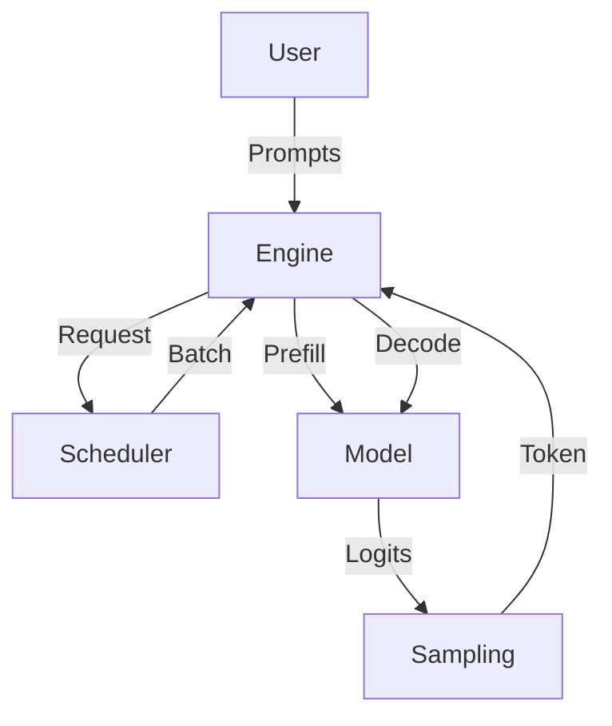

# The Engine (`engine.py`)

The `InferenceEngine` class is the conductor of the orchestra. It ties everything together.

## The Process Visualized



## Responsibilities

- **Initialization**: Loads the Model, Tokenizer, Scheduler, and Memory Manager.
- **Request Entry**: Accepts `generate()` calls and pushes them to the Scheduler.
- **The Loop**: Runs the continuous batching loop `_run_generation_loop`.

## Key Method: `_run_generation_loop`

This is the heart of continuous batching.

```python
while has_active_requests:
    # 1. Ask Scheduler for work
    prefill_batch, decode_batch = scheduler.schedule_step()

    # 2. Run Prefill (Compute-bound)
    if prefill_batch:
        run_prefill(prefill_batch)

    # 3. Run Decode (Memory-bound)
    if decode_batch:
        run_decode(decode_batch)
```

In Mini-YAIE, the loop logic is simplified for education, but the structure mirrors production engines.
