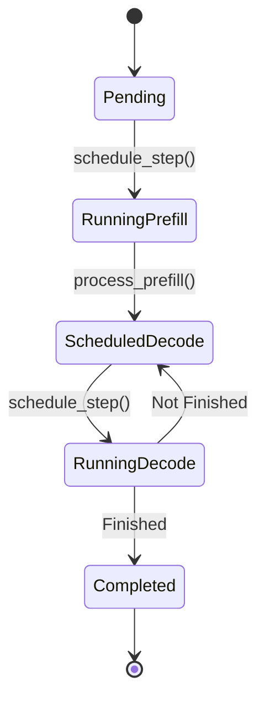

# The Scheduler (`core/sglang_scheduler.py`)

The `SGLangScheduler` is the "Brain". It decides _what_ runs _when_.

## SGLang Features

Unlike a simple FIFO queue, this scheduler is aware of **Radix Attention**.

### Prefix Hashing

When a request arrives, `_calculate_prefix_hash` identifies its common prefix.

```python
# Simplified Logic
prefix_hash = sha256(prompt)
```

In a full implementation, this uses the Radix Tree to find the precise token match.

### Scheduling Policy

1.  **Prioritize Decode**: To minimize latency, we always try to run pending decode steps first.
2.  **Fill with Prefill**: If there is leftover GPU memory (or batch size capacity), we pull new requests from the queue for prefill.



## State Machine

Requests transition through states:
`PENDING` -> `RUNNING_PREFILL` -> `SCHEDULED_DECODE` -> `RUNNING_DECODE` -> `COMPLETED`
