# Continuous Batching

## The Problem: Static Batching

In traditional deep learning (like training), we use static batches: all sequences in a batch must have the same length (padded to the max length).

- **Waste**: Padding wastes computation and memory.
- **Latency**: We must wait for the longest sequence to finish generating before finishing the batch.

## Visualizing the Difference

```mermaid
gantt
    title Static Batching (Inefficient)
    dateFormat X
    axisFormat %s

    section Batch 1
    Req A (Short) :done, a1, 0, 2
    Padding       :crit, 2, 4
    Req B (Long)  :active, b1, 0, 4

    section Batch 2
    Req C :c1, 4, 6
```

```mermaid
gantt
    title Continuous Batching (Efficient)
    dateFormat X
    axisFormat %s

    section GPU Stream
    Req A (Short) :done, a1, 0, 2
    Req C (New!)  :active, c1, 2, 4

    section GPU Stream 2
    Req B (Long)  :active, b1, 0, 4
```

## The Solution: Continuous Batching (Orca)

Introduced by the Orca paper, Continuous Batching (or Iteration-level Batching) decouples the implementation of a batch from the user's view.

1.  **Iteration Level**: The engine runs one iteration (one forward pass) at a time.
2.  **Dynamic Insertion**: As soon as a request finishes, it enters the "Completed" state. A new request from the queue can immediately take its place in the next iteration.
3.  **No Padding**: We process only the valid tokens for each request.

This significantly improves **throughput** (requests per second) without hurting **latency** (time per token) for individual requests.
