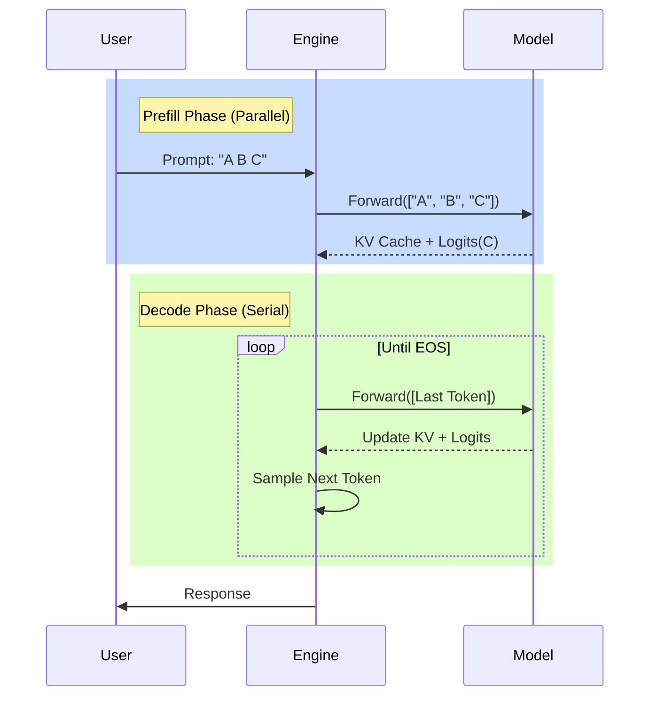

# LLM Inference: The Basics

Large Language Model (LLM) inference is the process of generating text from a trained model. It consists of two distinct phases.

## 1. Prefill Phase (The "Prompt")

- **Input**: The user's prompt (e.g., "Write a poem about cats").
- **Operation**: The model processes all input tokens in parallel.
- **Output**: The KV (Key-Value) cache for the prompt and the first generated token.
- **Characteristic**: Compute-bound. We maximize parallelism here.

## The Process Visualized

## 2. Decode Phase (The "Generation")

- **Input**: The previously generated token.
- **Operation**: The model generates one token at a time, autoregressively.
- **Output**: The next token and an updated KV cache.
- **Characteristic**: Memory-bound. We are limited by how fast we can move weights and KV cache from memory to the compute units.

## The KV Cache

State management is crucial. Instead of re-computing the attention for all previous tokens at every step, we cache the **Key** and **Value** vectors for every token in the sequence. This is the **KV Cache**. Managing this cache efficiently is the main challenge of high-performance inference engines.
