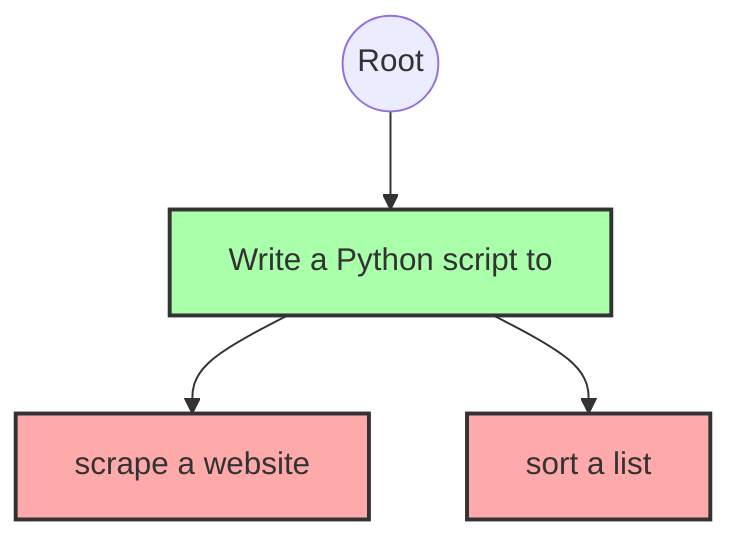

# Radix Attention (SGLang)

**Radix Attention** is the core innovation of SGLang. It optimizes the **Prefill Phase** by reusing computation from previous requests.

## The Intuition

If two users ask:

1.  "Write a Python script to **scrape a website**."
2.  "Write a Python script to **sort a list**."

They share the prefix "Write a Python script to ". In a standard engine, we would compute the KV cache for this prefix twice.

## The Radix Tree

SGLang maintains a **Radix Tree** (Trie) of all token sequences currently in the KV cache.

- **Nodes**: Sequences of tokens.
- **Edges**: Transitions to new tokens.

When a new request arrives, we map its prompt to the longest matching path in the Radix Tree.

- **Hit**: We reuse the KV Cache for the matched part. The prefill only needs to compute the _new_ suffix.
- **Miss**: We compute from scratch.

## Benefits

- **Reduced Latency**: "Time To First Token" (TTFT) is nearly zero for cached prefixes.
- **Higher Throughput**: Less computation required per request.
- **Complex Workflows**: Enables efficient multi-turn chat, few-shot learning, and tree-of-thought prompting.
