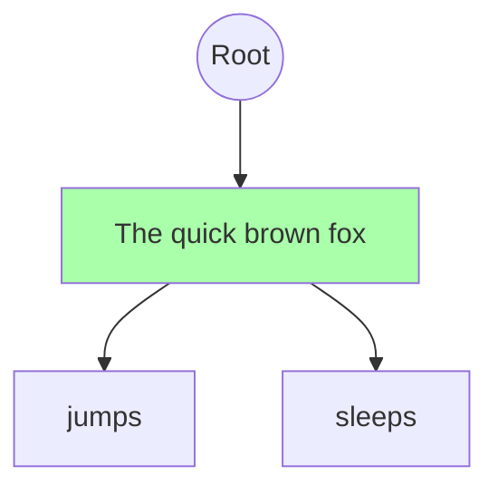
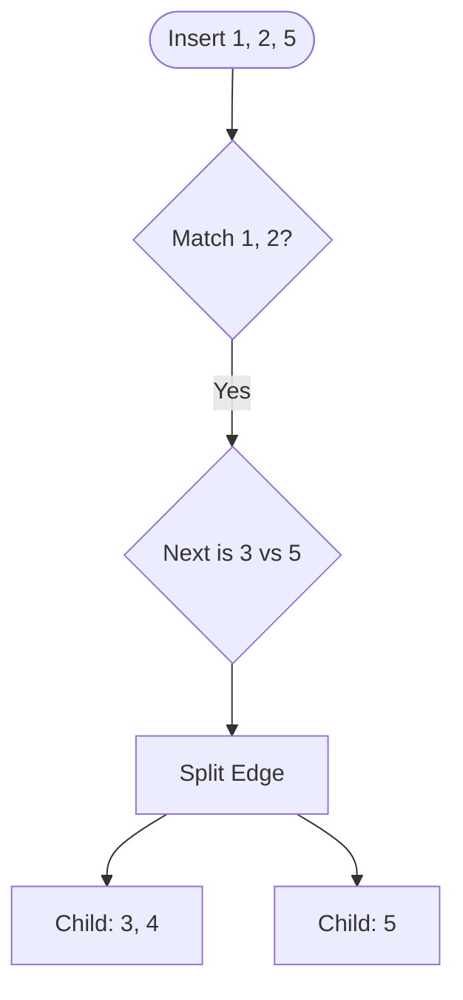

# Radix Tree (`kernels/radix_tree.py`)

## 1. Concept: The Prefix Tree

A **Radix Tree** (or Compressed Trie) is a data structure that succinctly stores sequences of tokens. Unlike a standard trie where each edge is a single character (or token), a Radix Tree allows edges to be **sequences** of tokens.

### Optimization Goal

When two requests start with `"The quick brown fox"`, we want to store that sequence **once**.

- **Request A**: `"The quick brown fox jumps"`
- **Request B**: `"The quick brown fox sleeps"`

In our tree, we should have a shared node for `"The quick brown fox"`, which then branches into `"jumps"` and `"sleeps"`.



---

## 2. Implementation Guide

Open `src/kernels/radix_tree.py`. You will implement the `RadixTree` class step-by-step.

### Step 1: Define the Tree Node

First, we need a node structure. Unlike a binary tree, a Radix Node can have many children.

```python
class RadixTreeNode:
    def __init__(self, prefix: List[int]):
        self.prefix = prefix               # The sequence of tokens on this edge
        self.children: Dict[int, RadixTreeNode] = {} # Map: first_token -> Child Node
        self.request_id: Optional[str] = None # If a request ends here, store its ID
        self.lock_count = 0                # Reference counting (how many requests use this?)
```

**Task**: Locate the `RadixTreeNode` class and ensure it has these fields.

---

### Step 2: Implement `match_prefix`

Before inserting, we need a way to see how much of a new prompt _already exists_ in the tree.

**Algorithm**:

1.  Start at `self.root`.
2.  Compare the input `token_ids` with the edges in the tree.
3.  Traverse down as long as the tokens match exactly.
4.  Return the last matching Node and the number of matching tokens.

**Your Turn**:
Implement `find_shared_prefixes(token_ids)` in `RadixTree`.

> _Hint_: Use a while loop. At each node, look at `node.children[token_ids[current_idx]]`. If it exists, check if the full edge `child.prefix` matches the next chunk of your input.

---

### Step 3: Implement `insert_request` (The Hard Part)

Now, inserting a new request. This involves **splitting** nodes if a partial match is found.

**Scenario**:

- Tree has edge `[1, 2, 3, 4]`.
- You insert `[1, 2, 5]`.

**Algorithm**:

1.  Trace the path like in Step 2.
2.  If you differ in the _middle_ of an edge (e.g., matched `1, 2` but tree has `3`, you have `5`):
    - **Split**: Create a new parent node for `[1, 2]`.
    - Make the old node `[3, 4]` a child of this new parent.
    - Create your new node `[5]` as another child.



**Your Turn**:
Implement `insert_request(request_id, token_ids)`.

- Use your `match_prefix` logic helper.
- Handle the 3 cases: Exact match, New Branch, or Split Edge.

---

### Step 4: Verify

Create a test script `tests/test_radix_manual.py`:

```python
tree = RadixTree()
tree.insert_request("req1", [1, 2, 3])
match, count = tree.find_shared_prefixes([1, 2, 3, 4])
print(f"Matched {count} tokens") # Should be 3!
```
