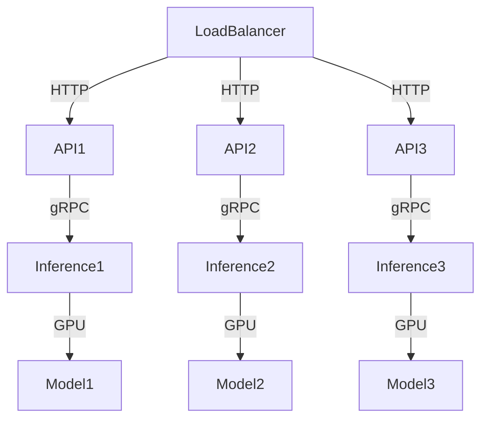

# Production Deployment

While Mini-YAIE is primarily educational, understanding production considerations helps bridge the gap between learning and real-world deployment.

## Deployment Architecture



## 1. Performance Optimization

### Batching & Latency Management

- **Request Timeouts**: Implement configurable timeouts for requests waiting in queue
- **Priority Queues**: Support different priority levels for requests
- **Preemption**: Pause low-priority requests and swap their KV-cache to CPU when high-priority requests arrive
- **Adaptive Batching**: Dynamically adjust batch sizes based on current load and latency requirements

### Continuous Batching Strategies

```python
# Advanced scheduling policies
class SchedulingPolicy(Enum):
    FCFS = "fcfs"  # First-come-first-served
    PRIORITY = "priority"  # Priority-based
    FAIR = "fair"  # Fair sharing
    LATENCY_OPTIMIZED = "latency"  # Minimize latency
```

## 2. Distributed Inference

### Tensor Parallelism

```python
# Split model weights across multiple GPUs
model = AutoModelForCausalLM.from_pretrained(
    model_name,
    device_map={
        "layer.0": "cuda:0",
        "layer.1": "cuda:1",
        "layer.2": "cuda:2",
        "layer.3": "cuda:3"
    }
)
```

### Pipeline Parallelism

```python
# Split layers across different stages
# Stage 1: Layers 0-10 on GPU 0
# Stage 2: Layers 11-20 on GPU 1
# Stage 3: Layers 21-30 on GPU 2
```

### Model Parallelism

- **Expert Parallelism**: For mixture-of-experts models
- **Sequence Parallelism**: For very long sequences
- **Hybrid Parallelism**: Combining multiple strategies

## 3. Memory Optimization

### Quantization

```python
# Load model with quantization
model = AutoModelForCausalLM.from_pretrained(
    model_name,
    load_in_8bit=True,  # 8-bit quantization
    device_map="auto"
)

# Or use 4-bit quantization
model = AutoModelForCausalLM.from_pretrained(
    model_name,
    load_in_4bit=True,
    device_map="auto"
)
```

### Memory Management Strategies

- **Paged Attention**: Efficient memory management for KV-cache
- **Memory Pooling**: Reuse memory blocks across requests
- **Swapping**: Move inactive KV-cache blocks to CPU memory
- **Compression**: Compress KV-cache values with minimal quality loss

## 4. Scalability & Reliability

### Horizontal Scaling

```python
# Multiple inference workers behind load balancer
workers = [
    InferenceWorker(model_name, gpu_id=0),
    InferenceWorker(model_name, gpu_id=1),
    InferenceWorker(model_name, gpu_id=2),
    InferenceWorker(model_name, gpu_id=3)
]
```

### Load Balancing

- **Round Robin**: Simple distribution across workers
- **Least Connections**: Send to least busy worker
- **Latency-based**: Send to worker with lowest current latency
- **Content-based**: Route based on request characteristics

### Health Monitoring

```python
# Health check endpoints
@app.get("/health")
def health_check():
    return {
        "status": "healthy",
        "gpu_memory": get_gpu_memory_usage(),
        "active_requests": scheduler.get_active_request_count(),
        "queue_length": scheduler.get_queue_status()
    }
```

## 5. Observability

### Metrics Collection

```python
# Prometheus metrics
REQUEST_LATENCY = Histogram(
    'request_latency_seconds',
    'Request latency in seconds',
    buckets=[0.1, 0.5, 1.0, 2.5, 5.0, 10.0]
)

TOKENS_PER_SECOND = Counter(
    'tokens_per_second',
    'Tokens generated per second'
)
```

### Logging

```python
# Structured logging
logger.info(
    "Request completed",
    request_id=request.id,
    latency=latency_seconds,
    tokens_generated=token_count,
    model=model_name
)
```

### Tracing

```python
# Distributed tracing
with tracer.start_span("generate_response") as span:
    span.set_attribute("model", model_name)
    span.set_attribute("request_id", request.id)
    response = engine.generate(prompt)
```

## 6. Security

### Authentication

```python
# API key authentication
@app.post("/v1/chat/completions")
async def chat_completions(
    request: ChatCompletionRequest,
    api_key: str = Header(None)
):
    if not validate_api_key(api_key):
        raise HTTPException(status_code=401, detail="Unauthorized")
```

### Rate Limiting

```python
# Rate limiting per API key
limiter = RateLimiter(
    requests_per_minute=1000,
    burst_capacity=100
)

@app.post("/v1/chat/completions")
@limiter.limit("1000/minute")
async def chat_completions(request: ChatCompletionRequest):
    # Process request
```

### Input Validation

```python
# Validate and sanitize inputs
@app.post("/v1/chat/completions")
async def chat_completions(request: ChatCompletionRequest):
    # Validate prompt length
    if len(request.prompt) > MAX_PROMPT_LENGTH:
        raise HTTPException(status_code=400, detail="Prompt too long")
    
    # Sanitize inputs
    sanitized_prompt = sanitize_input(request.prompt)
```

## 7. Configuration Management

### Environment Variables

```bash
# Configure through environment variables
export MODEL_NAME="gpt2"
export MAX_BATCH_SIZE="16"
export GPU_MEMORY_UTIL="0.9"
export ENABLE_RADIX_CACHE="true"
```

### Configuration Files

```yaml
# YAML configuration
model:
  name: "gpt2"
  dtype: "float16"
  tensor_parallel_size: 1

scheduler:
  max_batch_size: 16
  max_prefill_batch_size: 32
  max_decode_batch_size: 256

memory:
  gpu_blocks: 2000
  cpu_blocks: 1000
  block_size: 16
```

## 8. Deployment Strategies

### Containerization

```dockerfile
# Dockerfile for Mini-YAIE
FROM python:3.9-slim

WORKDIR /app
COPY requirements.txt .
RUN pip install -r requirements.txt

COPY . .
RUN pip install -e .

CMD ["yaie", "serve", "gpt2", "--host", "0.0.0.0", "--port", "8000"]
```

### Kubernetes Deployment

```yaml
# Kubernetes deployment
apiVersion: apps/v1
kind: Deployment
metadata:
  name: yaie-inference
spec:
  replicas: 3
  selector:
    matchLabels:
      app: yaie-inference
  template:
    metadata:
      labels:
        app: yaie-inference
    spec:
      containers:
      - name: yaie
        image: yaie:latest
        ports:
        - containerPort: 8000
        resources:
          limits:
            nvidia.com/gpu: 1
```

## 9. Performance Monitoring

### Key Metrics to Track

- **Latency**: Time from request to first token (TTFT) and time per token
- **Throughput**: Tokens generated per second
- **GPU Utilization**: Percentage of GPU time spent on computation
- **Memory Usage**: GPU and CPU memory consumption
- **Queue Length**: Number of requests waiting
- **Error Rates**: Percentage of failed requests

### Alerting

```python
# Set up alerts for critical conditions
if gpu_memory_usage > 0.95:
    alert("High GPU memory usage")

if request_latency > 5.0:  # 5 seconds
    alert("High request latency")

if error_rate > 0.01:  # 1%
    alert("High error rate")
```

## 10. Cost Optimization

### Resource Management

- **Auto-scaling**: Scale workers based on demand
- **Spot Instances**: Use cheaper spot instances for non-critical workloads
- **Right-sizing**: Choose appropriate instance types for workload
- **Batch Processing**: Process offline requests in batches during low-traffic periods

### Model Selection

```python
# Choose appropriate model size for use case
small_models = ["gpt2", "DialoGPT-small"]  # Fast, low cost
medium_models = ["gpt2-medium", "DialoGPT-medium"]  # Balanced
large_models = ["gpt2-large", "DialoGPT-large"]  # High quality, expensive
```

## Educational Focus

Understanding production considerations helps you:

1. **Bridge the gap** between educational implementations and real-world systems
2. **Appreciate the complexity** of production-grade inference engines
3. **Make informed decisions** about trade-offs in your implementations
4. **Design for scalability** from the beginning

## From Mini-YAIE to Production

Mini-YAIE provides the foundation for understanding key concepts:

- **Continuous Batching**: The core of efficient inference
- **Memory Management**: Critical for handling multiple requests
- **Prefix Sharing**: Advanced optimization for similar requests
- **API Design**: Standard interfaces for integration

Production systems build on these foundations with:

- **Scalability**: Handling thousands of concurrent requests
- **Reliability**: High availability and fault tolerance
- **Observability**: Comprehensive monitoring and logging
- **Security**: Authentication, authorization, and input validation

By mastering the concepts in Mini-YAIE, you'll be well-prepared to understand and contribute to production-grade inference systems like vLLM, SGLang, and TensorRT-LLM.